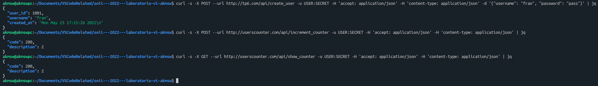

# Laboratorio Nº6 - Embedded systems (2)
## Introduction
El presente es un trabajo práctico de laboratorio cuyo objetivo es el de desarrollar una implementación básica de una RESTful API para lograr una visión *end-to-end* de las mismas sobre un sistema embebido.
## Startup
Para comenzar, se debe clonar el repositorio. Una vez hecho, podemos compilar todo el proyecto aprovechando el archivo makefile, con el comando `make all` o, simplemente `make`. Esto compilará el proyecto con las flags indicadas en la consigna: `-Wall -pedantic -Werror -Wextra -Wconversion -std=gnu11`.\
Como se trabajará con las librerías [Ulfius](https://github.com/babelouest/ulfius), [Jansson](https://github.com/akheron/jansson) y [Yder](https://github.com/babelouest/yder), se agregan las flags `-lulfius`, `-ljansson` y `-lyder`.
## Development
Este trabajo consta de dos servicios: **users_manager** y **counter_manager**. Ambos trabajan en conjunto para ofrecer la funcionalidad de crear usuarios en el sistema, llevando la cuenta de cuántos usuarios se crearon.\
Los mensajes de response y las requests se manejan en formato JSON.\
Se hace uso de [nginx](https://www.nginx.com/) para direccionar las requests a los endpoints de los servicios correspondientes.\
Si el usuario quiere conectarse con el servicio **users_manager**, puede hacerlo mediante la herramienta [cURL](https://curl.se/) enviando una request al dominio `tp6.com`. Si, en cambio, quiere conectarse con el servicio **counter_manager**, deberá enviar una request al dominio `userscounter.com`. Si se intenta conectar con algún path no existente, se obtendrá un mensaje de error con código 404. Sólo se trabaja con conexiones HTTP.
Los servicios se registran mediante [systemd](https://en.wikipedia.org/wiki/Systemd) para que comiencen al iniciarse el sistema operativo, aprovechando los comandos `restart`, `reload`, `start` y `stop`.\
El gráfico a continuación describe el esquema del proyecto:
\
Para mantener un registro de las acciones llevadas a cabo, se hace uso de logs para cada servicio con el siguiente formato:
```
<Timestamp> - <Nombre_del_servicio> : <Mensaje>
```
Se implementó la herramienta [logrotate](https://linux.die.net/man/8/logrotate) para configurar el mecanismo de rotación de logs. Esto se hizo con el propósito de que no se acumulen archivos de log innecesarios, siendo que pueden ocupar mucho espacio y en sistemas embebidos la memoria es un recurso crítico.\
Se tomó como criterio una rotación cada una hora, manteniendo sólo un archivo de log por cada servicio, con un tamaño máximo de 10MB, y que los logs se compriman para ahorrar más espacio aún.

A continuación se detallan los dos servicios y las funcionalidades (endpoints) de cada uno.
### Users manager service
Este servicio se encargará de crear usuarios y listarlos. Estos usuarios pueden ingresar mediante SSH luego de su creación.
#### Endpoint /api/create_user (POST)
Para crear un usuario en el sistema operativo, se puede enviar una request a este endpoint de la forma:
```sh
curl -s
     -X POST
     --url http://tp6.com/api/create_user
     -u USER:SECRET
     -H 'accept: application/json'
     -H 'content-type: application/json'
     -d '{"username": "my_user", "password": "my_password"}'
```
Si se realiza correctamente, la respuesta esperada será de la forma:
```json
{
    "id": 142,
    "username": "my_user",
    "created_at": "2019-06-22 02:19:59"
}
```
El mensaje para el log será: *User **id** created*.\
Cada vez que se cree un usuario, este servicio incrementa el contador en el servicio de contador de usuarios, enviándole una request para ello.\
En caso de que el servicio de contador no esté disponible o falle, se registra el error en el archivo de log.
#### Endpoint /api/show_users (GET)
Para obtener todos los usuarios del sistema operativo y sus identificadores, se puede enviar una request a este endpoint de la forma:
```sh
curl -s
     -X GET
     --url http://tp6.com/api/show_users
     -u USER:SECRET
     -H 'accept: application/json'
     -H 'content-type: application/json'
```
Si se realiza correctamente, la respuesta esperada será de la forma:
```json
{
    "data": [
        {
            "user_id": 1,
            "username": "user1",
        },
        {
            "user_id": 2,
            "username": "user2"
        },
        ...
    ]
}
```
El  mensaje para el log será:  *Total users created: **cantidad_de_usuarios_del_SO***.
### Counter manager service
Este microservicio administra un contador de usuarios.
#### Endpoint /api/increment_counter (POST)
Para incrementar manualmente el contador, se puede enviar una request a este endpoint de la forma:
```sh
curl -s
     -X POST
     --url http://userscounter.com/api/increment_counter
     -u USER:SECRET
     -H 'accept: application/json'
     -H 'content-type: application/json'
```
Si se realiza correctamente, la respuesta esperada será de la forma:
```json
{
    "code": 200,
    "description": "<new_value>"
}
```
El  mensaje para el log será: *Counter incremented from device **IP_del_cliente_que_incrementó_el_contador***.
#### Endpoint /api/show_counter (GET)
Para obtener el valor actual del contador que administra este servicio, se puede enviar una request a este endpoint de la forma:
```sh
curl -s
     -X GET
     --url http://userscounter.com/api/show_counter
     -u USER:SECRET
     -H 'accept: application/json'
     -H 'content-type: application/json'
```
Si se realiza correctamente, la respuesta esperada será de la forma:
```json
{
    "code": 200,
    "description": "<value>"
}
```
Las requests a este endpoint no registran ningún mensaje en los archivos de log.
## Ease of use
Se provee un bashscript llamado `install`. Al ejecutarlo, se revisará que estén instaladas las dependencias para que este trabajo funcione correctamente (nginx, systemd y logrotate). Si alguna dependencia no está instalada, se la instalará.\
Una vez corroborado, se hace uso del archivo de makefile para compilar y configurar el proyecto. Esto incluye la copia de archivos a las carpetas de nginx, systemd y logrotate correspondientes para levantar los servicios como fue pedido. Se asume que las librerías Ulfius, Jansson y Yder están instaladas en el sistema.\
Cuando la instalación del proyecto haya finalizado, se pueden enviar requests a los servicios como fue especificado en la sección anterior.
## Recommendations
Como se trabajará con formato JSON para las requests y las responses, se recomienda la instalación del procesador JSON para línea de comandos [jq](https://stedolan.github.io/jq/). Este procesador toma el output en formato JSON de un comando y lo formatea para que sea más legible para el usuario. Basta con conectar una request de cualquier tipo mediante un pipe con jq de la forma:
```sh
curl -s
     -X GET
     --url http://userscounter.com/api/show_counter
     -u USER:SECRET
     -H 'accept: application/json'
     -H 'content-type: application/json'
| jq
```
y la salida será formateada para una mayor legibilidad.
## Screenshots
\
*Figura 1: Correcto output de comandos de creación de usuario, incremento de contador y muestra de contador.*\
\
*Figura 2: Correcto output del comando de muestra de usuarios del sistema operativo.*\
\
*Figura 3: Correcto registro de eventos en los archivos de log.*
## Known issues
- Como el trabajo fue desarrollado en una computadora personal, si se quiere probar en otro equipo se deberán modificar los archivos `.service` de systemd y el archivo de logrotate con las carpetas correspondientes.
